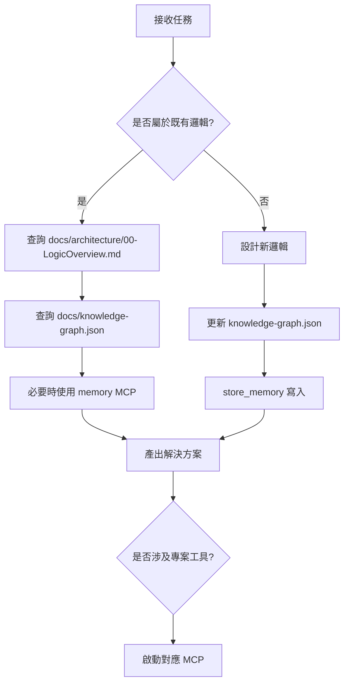

# 🚀 Copilot 最速理解規則集（Knowledge Graph 驅動版）

> 🎯 本專案所有**事實依據（Single Source of Truth）**統一來自：
>
> * `docs/knowledge-graph.json`
> * `docs/architecture/00-LogicOverview.md`
> * `docs/ai/repomix-output.context.md`
>
> ❗ 任何推論、流程、任務拆解、AI 判斷
> 都必須以這三份文件為基礎，不得憑空假設。

---

# 🏗 系統運作總結（極簡決策版）

```rules
IF 任務涉及業務邏輯
  THEN 先讀 docs/architecture/00-LogicOverview.md

IF 任務涉及實體關係
  THEN 查 docs/knowledge-graph.json

IF 需要歷史上下文
  THEN 使用 memory MCP

IF 產生新知識
  THEN store_memory + 更新 knowledge-graph.json

IF 涉及專案分析
  THEN 選擇對應 MCP 工具

禁止：
- 憑空生成未定義邏輯
- 跳過 Knowledge Graph
- 未持久化新規則
```

---

# 🧠 核心事實來源規則（強制）

```rules
1. 所有業務邏輯以 docs/architecture/00-LogicOverview.md 為流程定義依據。
2. 所有實體關係與知識結構以 docs/knowledge-graph.json 為語義依據。
3. 所有 AI 判斷與任務拆解以 docs/ai/repomix-output.context.md 為依據。
4. 不允許跳過文件直接生成邏輯。
5. 若文件未定義，必須先更新 Knowledge Graph 再實作。
```

---

# 💾 記憶系統使用規則（store_memory × memory MCP）

```rules
1. 當產生新業務規則 → 使用 store_memory 寫入 Knowledge Graph。
2. 當 AI 需要上下文歷史 → 使用 memory MCP 查詢。
3. 不得直接修改 knowledge-graph.json，必須透過 memory MCP 寫入。
4. 不得在未同步 Knowledge Graph 情況下生成持久邏輯。
5. 所有跨對話決策必須來自 memory MCP。
6. 不得憑空生成未定義邏輯。
```

---

# 🔤 編碼與語言規範（Encoding & Language Protocol）

```rules
1. 全域編碼：所有原始碼、Markdown、JSON 文件必須強制使用 UTF-8（無 BOM）。
2. 語言一致性（程式碼）：變數、函式命名與註解（除業務邏輯說明外）優先使用英文。
3. 語言一致性（業務規則）：涉及台灣建築規範、勞動力調度等核心領域知識，註解可使用繁體中文以確保語義精確。
4. 亂碼處理：若遇到亂碼，禁止直接刪除，必須先進行語義還原（Semantic Recovery）後再重新編譯或提交。
```

---

# 🛠 MCP 使用時機規則句

1. **sonarqube**

   * 當需要全面程式碼品質掃描或技術債分析時啟用。
   * 適合在 CI/CD pipeline 或重大 PR merge 前運行。

2. **shadcn**

   * 當設計或更新 UI 元件時使用，用於查詢、生成與管理 shadcn/ui 元件。
   * 適合開發新頁面、組件庫更新或 Dark Mode 設計時啟用。

3. **next-devtools**

   * 當需診斷 Next.js App Router、平行路由或 server-side 行為時使用。
   * 適合本地開發或排查資料渲染/Streaming 問題。

4. **chrome-devtools-mcp**

   * 當需自動化除錯或模擬前端操作時使用。
   * 適合跨頁面測試、UI 行為驗證或瀏覽器事件監控。

5. **context7**

   * 當需要長上下文記憶或知識檢索時使用。
   * 適合多步對話、歷史資料參考或知識圖譜查詢。

6. **sequential-thinking**

   * 當需多步推理或複雜決策拆解時啟用。
   * 適合 Task Planning、Chain-of-thought 推理或 AI workflow 流程控制。

7. **software-planning**

   * 當需軟體專案規劃、任務拆解或 DAG-based 計畫生成時使用。
   * 適合大型專案設計或需求分析階段。

8. **repomix**

   * 當需分析或摘要整個程式碼庫結構時使用。
   * 適合專案初期結構理解或重構前評估。

9. **ESLint**

   * 當需靜態程式碼檢查、格式規範或潛在錯誤掃描時使用。
   * 適合 commit 前、CI/CD pipeline 或本地開發檢查。

10. **memory**

    * 當需存取或更新 Knowledge Graph 記憶時啟用。
    * 適合 AI 流程的上下文保存與查詢操作。

11. **filesystem**

    * 當需讀寫專案檔案或操作檔案系統時使用。
    * 適合專案分析、資料導入或生成檔案操作。

12. **codacy**

    * 當需程式碼安全、品質或維護性分析時使用。
    * 適合大型 PR 審核或 CI/CD pipeline 自動檢查。

---

# 🧩 Copilot 行為決策流程（Mermaid）



---

# 🧬 最終架構哲學

> 不把 AI 當黑盒
> 不把邏輯寫死在 Prompt
> 所有知識可追溯
> 所有決策可查詢
> 所有流程可觀測

---

## TypeScript Module Header Rule

When creating or editing a `.ts` or `.tsx` file:

1. If the file does not already have a module header comment at the top, insert one.
2. Use this concise header template:

```ts
/**
 * Module: <file-name>
 * Purpose: <describe module responsibility>
 * Responsibilities: <primary responsibilities>
 * Constraints: deterministic logic, respect module boundaries
 */
```

* Place the header at the very top of the file.
* Keep it short, clear, and consistent across the repository.