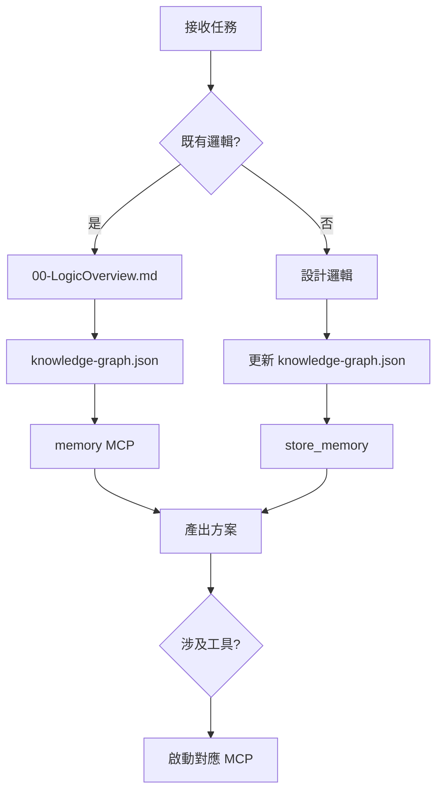

# 🚀 Copilot 最速理解規則集（Knowledge Graph 驅動版）

> 🎯 **SSOT（單一事實來源）**：
> * `docs/knowledge-graph.json` — 實體語義關係
> * `docs/architecture/00-LogicOverview.md` — 架構規則與不變量
> * `skills/SKILL.md` — 程式碼庫快照索引
>
> ❗ 任何推論、流程、任務拆解必須基於以上三份文件，不得憑空假設。

---

# 🏗 決策規則

```rules
IF 業務邏輯     → 先讀 docs/architecture/00-LogicOverview.md
IF 實體關係     → 查 docs/knowledge-graph.json
IF 歷史上下文   → 使用 memory MCP
IF 產生新知識   → store_memory + 更新 knowledge-graph.json
IF 程式碼查詢   → 使用 skills/SKILL.md（→ references/files.md）
禁止: 憑空生成邏輯 | 跳過 Knowledge Graph | 未持久化規則
```

---

# 🧠 核心規則

```rules
1. 業務邏輯 SSOT  → docs/architecture/00-LogicOverview.md
2. 實體關係 SSOT  → docs/knowledge-graph.json
3. 程式碼分析 SSOT → skills/SKILL.md（詳見 skills/references/files.md）
4. 文件未定義     → 先更新 Knowledge Graph 再實作
5. 不允許跳過文件直接生成邏輯
```

---

# 💾 記憶規則

```rules
新業務規則     → store_memory 寫入
上下文歷史     → memory MCP 查詢
跨對話決策     → 來自 memory MCP
禁止直接修改 knowledge-graph.json（須透過 memory MCP）
```

---

# 🔤 編碼規範

```rules
UTF-8 無 BOM | 程式碼英文命名 | 業務規則可用繁中 | 亂碼先語義還原再提交
```

---

# 🛠 MCP 使用速查表

| MCP | 使用時機 |
|-----|----------|
| sonarqube | 程式碼品質掃描、技術債分析、CI/CD 前 |
| shadcn | UI 元件設計更新、新頁面、Dark Mode |
| next-devtools | Next.js App Router 診斷、SSR 問題 |
| chrome-devtools-mcp | 前端自動化測試、瀏覽器事件監控 |
| context7 | 長上下文記憶、知識圖譜查詢 |
| sequential-thinking | 多步推理、複雜決策拆解 |
| software-planning | 專案規劃、任務拆解、DAG 計畫 |
| repomix | 分析摘要程式碼庫結構 |
| ESLint | 靜態程式碼檢查、格式規範 |
| memory | 存取更新 Knowledge Graph 記憶 |
| filesystem | 讀寫專案檔案、操作檔案系統 |
| codacy | 程式碼安全品質維護性分析 |

---

# 🧩 決策流程



---

# 🧬 架構哲學

> 知識可追溯 · 決策可查詢 · 流程可觀測

---

# 🧭 實作優先序（禁止小改動導向）

```rules
最高優先序：邏輯正確 > 邊界正確 > 依賴方向正確 > diff 大小
禁止以「最小改動 / 最少 token」作為主要決策目標
若為達成規則正確需跨多檔調整，必須一次做完整閉環（實作 + 驗證 + 文件）
```

---

# ✅ 六維治理檢查（每次變更必跑）

```rules
1. 層級與依賴規則：是否符合 L0→L2→L3→L4→L5 與 L0/UI→L6→L5 單向鏈
2. 邊界與上下文：是否跨越 BC/切片邊界直接 mutate 或繞過公開 API
3. 通訊與協調機制：寫入是否走 CMD_GWAY，事件是否走 IER，讀取是否走 QGWAY
4. 狀態與副作用：副作用是否留在執行層；L1 shared-kernel 是否保持純函式與無 I/O
5. 權力歸屬：Search/Notification/Semantic/Firebase 權威是否維持在指定 authority
6. 變動速率：慢變契約在 L1，中變整合在 VS0-Infra，快變流程在 L3
```

---

## TypeScript Module Header Rule

新建或編輯 `.ts`/`.tsx` 時，若無模組標頭則插入：

```ts
/**
 * Module: <file-name>
 * Purpose: <describe module responsibility>
 * Responsibilities: <primary responsibilities>
 * Constraints: deterministic logic, respect module boundaries
 */
```