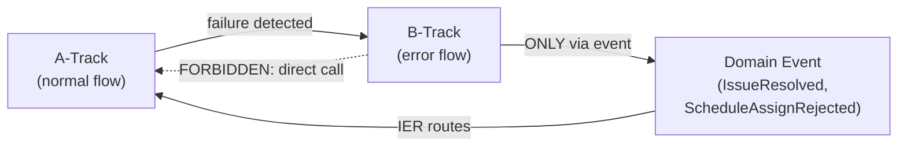

# GEMINI.md — AI Collaboration Constitution

> **Source of truth**: [`docs/logic-overview.md`](./docs/logic-overview.md)
> **Mandatory read before modifying any code in this repository.**
> This file defines the rules, guards, and contracts that all AI agents MUST enforce when working in this codebase.

---

## 1. Core Instruction Set

### 1.1 TRACE_PROPAGATION_RULE [R8]

```
traceId is injected ONCE at CBG_ENTRY.
It MUST NOT be overwritten by any downstream node.
Every audit record in globalAuditView MUST contain traceId.
FCM push notification metadata MUST include traceId.
```

**AI Rule**: Before modifying any code that touches `EventEnvelope`, `IER`, `event-funnel`, `globalAuditView`, or FCM delivery — verify that `traceId` passes through unchanged and is NOT regenerated or overwritten.

### 1.2 TAG_STALE_GUARD [S4]

```
TAG_MAX_STALENESS     ≤ 30s   (tag-derived data)
PROJ_STALE_CRITICAL   ≤ 500ms (authorization / scheduling projections)
PROJ_STALE_STANDARD   ≤ 10s   (general projections)
```

**AI Rule**: SLA numbers are FORBIDDEN in component/node text. Always reference `SK_STALENESS_CONTRACT` constants from `shared.kernel.staleness-contract`. Never hardcode `30000`, `500`, or `10000` ms directly.

### 1.3 SK_CMD_RESULT — Command Result Contract [R4]

Every Server Action (`_actions.ts`) MUST return one of these two shapes:

```typescript
/** Successful command execution */
interface CommandSuccess {
  readonly success: true;
  /** Affected aggregate's ID — used for optimistic update reconciliation */
  readonly aggregateId: string;
  /** New version after the command — used for projection version guard [S2] */
  readonly version: number;
}

/** Failed command execution */
interface CommandFailure {
  readonly success: false;
  /** Structured domain error */
  readonly error: DomainError;
}

interface DomainError {
  /** Machine-readable error code (from shared.kernel.constants ErrorCodes) */
  readonly code: string;
  /** Human-readable message */
  readonly message: string;
  /** Originating aggregate (for debugging) */
  readonly aggregateId?: string;
}

/** Union type used as return from all _actions.ts exports */
type CommandResult = CommandSuccess | CommandFailure;
```

**AI Rule**: All `_actions.ts` exports MUST return `CommandResult`. Never return `void`, `undefined`, or raw Firestore `DocumentReference`.

### 1.4 WORKFLOW_STATE_CONTRACT [R6]

```
Legal state transitions only:
  Draft → InProgress → QA → Acceptance → Finance → Completed

blockedBy rules:
  blockWorkflow(issueId)   → blockedBy.add(issueId)
  unblockWorkflow          → requires blockedBy.isEmpty()
  IssueResolved event      → blockedBy.delete(issueId)  (ONLY trigger)
```

**AI Rule**: `workflow` aggregate state machine transitions are CLOSED. No new transitions may be added without updating `docs/logic-overview.md` first. The `blockedBy` Set is the ONLY mechanism for blocking — never use boolean flags or status strings to represent blocking.

---

## 2. Cross-Slice Boundary Warnings

These are HARD rules. Violations are **architectural errors**, not style issues.

### 2.1 The 10 Cross-Slice Communication Prohibitions

| # | Prohibition | Correct Pattern |
|---|-------------|----------------|
| **#1** | BC X may NOT write to BC Y's Aggregate | Emit Domain Event; let BC Y react via IER subscription |
| **#2** | Cross-BC reads via internal state | Use Projection (read model) or ACL anti-corruption layer |
| **#3** | Domain rules in Application Layer | Domain rules live in Aggregates only; Application Layer coordinates only |
| **#4** | TX Runner may NOT create events | TX Runner delivers to Outbox only; events are created by Aggregates |
| **#5** | Custom Claims used as authoritative permission source | Claims are a snapshot with TTL — always re-verify against Aggregate for critical decisions |
| **#6** | Notification Router queries Aggregates directly | Notification Router reads ONLY Projection data |
| **#7** | Scope Guard reads another slice's state | Scope Guard reads ONLY its own `workspace-scope-guard-view` |
| **#8** | Cross-BC sharing without `shared.kernel.*` label | Any cross-BC reuse MUST live in `shared.kernel.*` and be explicitly annotated |
| **#9** | Projection state that cannot be rebuilt from events | Every Projection MUST be fully rebuildable from its event stream |
| **#10** | Module reads another module's internal Context state | Requiring another module's internal state = boundary design error → redesign |

### 2.2 File Import Rules (D2, D7)

```
✅ ALLOWED
import { something } from '@/features/account-user.wallet/index';

❌ FORBIDDEN — private file cross-slice import
import { internalFn } from '@/features/account-user.wallet/_aggregate';
import { privateHelper } from '@/features/workspace-core/_tx-runner';

✅ ALLOWED — shared kernel (pure functions + contracts only)
import { applyVersionGuard } from '@/features/shared.kernel.version-guard';
```

### 2.3 Type Placement & Import Precedence (D8 extension)

```
✅ PREFERRED — cross-BC contract from shared kernel
import { SkillRequirement } from '@/features/shared.kernel.skill-tier';
// Note: if current codebase is still in transition, follow temporary compatibility rules
// documented in docs/project-structure.md before completing migration.

✅ ALLOWED — slice-owned type via public API
import type { WorkspaceLocation } from '@/features/workspace-core';

⚠ LEGACY ONLY — src/shared/types for compatibility/common DTOs
import type { SomeLegacyDto } from '@/shared/types';

❌ FORBIDDEN — adding new cross-BC domain contracts to src/shared/types by default
// Put new cross-BC contracts in shared.kernel.* first
```

Rule priority:
1. shared.kernel.* (cross-BC contract)
2. feature slice public API (`{slice}/index.ts`)
3. shared/types only as legacy/common fallback

### 2.4 Server Action Entry Point Rule (D3, D5)

```
✅ ALLOWED
// src/features/workspace-application/_actions.ts
export async function createWorkspace(...): Promise<CommandResult> { ... }

❌ FORBIDDEN — direct Firestore in UI component
import { db } from '@/shared/infra/firebase';
const doc = await db.collection('workspaces').add({ ... }); // NEVER in components

❌ FORBIDDEN — Server Action NOT in _actions.ts
// src/app/(dashboard)/page.tsx
export async function serverFunction() { ... } // NEVER in app/ layer
```

---

## 3. VS0 Shared Kernel Reference

Before adding new outbox, projection, or entry point, verify compliance with the relevant contract:

### 3.1 Adding a New Outbox [S1]

**Checklist**:
1. Import `DlqTier`, `OutboxRecord`, `buildIdempotencyKey` from `shared.kernel.outbox-contract`
2. Declare DLQ tier (`SAFE_AUTO` / `REVIEW_REQUIRED` / `SECURITY_BLOCK`) based on event sensitivity
3. Include `idempotencyKey = buildIdempotencyKey(eventId, aggregateId, version)`
4. Do NOT redefine at-least-once semantics locally

```typescript
// Example: new outbox record
import { buildIdempotencyKey, DlqTier } from '@/features/shared.kernel.outbox-contract';

const outboxRecord = {
  idempotencyKey: buildIdempotencyKey(event.eventId, event.aggregateId, event.aggregateVersion),
  dlqTier: DlqTier.SAFE_AUTO,   // declare sensitivity
  lane: 'STANDARD_LANE',
  payload: event,
  createdAt: Date.now(),
};
```

### 3.2 Adding a New Projection [S2]

**Checklist**:
1. Import `applyVersionGuard` from `shared.kernel.version-guard`
2. Call guard BEFORE writing to Firestore
3. Register projection with `projection.registry`

```typescript
import { applyVersionGuard } from '@/features/shared.kernel.version-guard';

async function applyMyEvent(envelope: EventEnvelope, db: Firestore) {
  const existing = await db.collection('myView').doc(envelope.aggregateId).get();
  const lastVersion = existing.data()?.lastProcessedVersion ?? -1;

  // S2: version guard — discard stale events
  if (!applyVersionGuard(envelope.aggregateVersion, lastVersion)) {
    return; // stale event — discard silently
  }

  await db.collection('myView').doc(envelope.aggregateId).set({
    // ... projected fields
    lastProcessedVersion: envelope.aggregateVersion,
    traceId: envelope.traceId, // [R8] always carry traceId
  }, { merge: true });
}
```

### 3.3 Read Consistency Decision Rule [S3]

```
Involves balance / authorization / irreversible operation?
  → STRONG_READ: query the Aggregate directly (source of truth)

Display / statistics / listing?
  → EVENTUAL_READ: query the Projection (read model)
```

### 3.4 New External Entry Point [S5]

Any entry point reaching `CBG_ENTRY` that is NOT `_actions.ts` (Webhook, Edge Function, scheduled job) MUST satisfy `SK_RESILIENCE_CONTRACT` before going to production:

```typescript
import { RateLimitConfig, CircuitBreakerConfig, BulkheadConfig } from '@/features/shared.kernel.resilience-contract';

// Required: rate-limit per user ∪ per org
// Required: circuit-break on consecutive 5xx → 503
// Required: bulkhead isolation (failure in one slice MUST NOT cascade)
```

### 3.5 Claims Refresh [S6]

Any change to Claims refresh logic MUST update all THREE parties simultaneously:

1. `identity-account.auth` → `CLAIMS_HANDLER` (VS1)
2. `infra.event-router` → IER `CRITICAL_LANE` routing for `RoleChanged` / `PolicyChanged`
3. Frontend token listener → force token reload on `TOKEN_REFRESH_SIGNAL`

---

## 4. SECURITY_BLOCK DLQ Handling

```
⛔ SECURITY_BLOCK tier is the highest severity level.
   It applies to: RoleChanged, PolicyChanged, ClaimsRefresh failure.
```

### Processing Rules

```
SECURITY_BLOCK event hits DLQ:
  1. Alert fires → domain-error-log (VS9)
  2. Affected entity is FROZEN (no further operations allowed)
  3. Requires EXPLICIT authorization from security team to replay
  4. Auto-replay is FORBIDDEN for SECURITY_BLOCK events
  5. Manual replay only after root cause resolution
```

### AI Rule for SECURITY_BLOCK

When modifying ANY code that touches:
- `account-governance.role` or `account-governance.policy`
- `CLAIMS_HANDLER` in `identity-account.auth`
- DLQ processing in `infra.dlq-manager`

Verify that:
1. Failed delivery routes to `SECURITY_BLOCK` (not `SAFE_AUTO` or `REVIEW_REQUIRED`)
2. The alert path to `domain-error-log` remains intact
3. Auto-replay is NOT enabled for security events

---

## 5. A-Track / B-Track Recovery Principle

```
A-Track: normal business execution flow
B-Track: error / exception flow

RULE: B-Track MUST NOT directly call back into A-Track.
      B-Track communicates back ONLY via Domain Event.
```

**Examples**:
- ✅ `ScheduleAssignRejected` event → IER → A-Track re-evaluates eligibility
- ❌ `scheduleAssign()` directly calling `cancelPreviousAssignment()` on another aggregate



---

## 6. Quick Reference — What to Check Before Each Task

### Before modifying `_actions.ts`
- [ ] Returns `CommandResult` (success/failure union)
- [ ] Uses `buildIdempotencyKey` for outbox records [S1]
- [ ] `traceId` is from `CBG_ENTRY` — not regenerated [R8]
- [ ] Satisfies `SK_RESILIENCE_CONTRACT` if it's a new entry point [S5]

### Before adding a new Projection
- [ ] Calls `applyVersionGuard` before Firestore write [S2] [#19]
- [ ] Registered in `projection.registry`
- [ ] SLA declared via `SK_STALENESS_CONTRACT` constants [S4]
- [ ] `traceId` stored in every projection record [R8]

### Before adding a new Outbox
- [ ] `dlqTier` declared using `DlqTier` enum [S1]
- [ ] `idempotencyKey` uses `buildIdempotencyKey` [S1]
- [ ] Lane target declared (`CRITICAL` / `STANDARD` / `BACKGROUND`)

### Before modifying Claims or Role logic
- [ ] All 3 parties updated simultaneously [S6][D18]
- [ ] `SECURITY_BLOCK` DLQ path preserved
- [ ] `domain-error-log` alert path intact

### Before adding a new cross-slice dependency
- [ ] Only importing `{slice}/index.ts` (not `_{private}.ts`) [D7]
- [ ] Shared types live in `shared.kernel.*` [D8]
- [ ] No BC is directly mutating another BC's Aggregate [#1]
