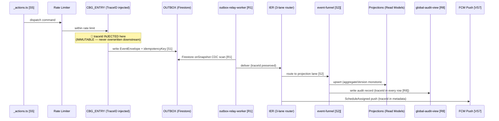

# Xuanwu — Production-Ready DDD × Next.js 16 System

> **System status**: v10 — VS0 contract consolidation: SK_OUTBOX_CONTRACT, SK_VERSION_GUARD, SK_READ_CONSISTENCY, SK_STALENESS_CONTRACT, SK_RESILIENCE_CONTRACT, SK_TOKEN_REFRESH_CONTRACT all down-shifted to Shared Kernel.
> **Architecture spec**: [`docs/logic-overview.md`](./docs/logic-overview.md) (sole source of truth — replace this file to upgrade the spec)

---

## Core Data Flow

Command → Outbox → Relay → IER → Funnel → Projections



### IER Priority Lanes

| Lane | SLA | Examples |
|------|-----|---------|
| 🔴 CRITICAL | ≤ 500ms | RoleChanged → CLAIMS_HANDLER [S6], WalletDeducted |
| 🟡 STANDARD | ≤ 10s | ScheduleAssigned, MemberJoined, SkillXpAdded |
| ⚪ BACKGROUND | ≤ 30s | TagLifecycleEvent, AuditEvents |

---

## Quick Start

### Prerequisites

- Node.js 20 LTS
- Firebase CLI (`npm install -g firebase-tools`)
- Firebase project with Authentication, Firestore, and Functions enabled

### Environment Variables

Create `.env.local` from the template:

```bash
# Firebase Client (public — exposed to browser)
NEXT_PUBLIC_FIREBASE_API_KEY=
NEXT_PUBLIC_FIREBASE_AUTH_DOMAIN=
NEXT_PUBLIC_FIREBASE_PROJECT_ID=
NEXT_PUBLIC_FIREBASE_STORAGE_BUCKET=
NEXT_PUBLIC_FIREBASE_MESSAGING_SENDER_ID=
NEXT_PUBLIC_FIREBASE_APP_ID=

# Firebase Admin (server-only — never expose to client)
FIREBASE_SERVICE_ACCOUNT_KEY=   # base64-encoded service account JSON
FIREBASE_DATABASE_URL=

# Genkit AI
GOOGLE_GENAI_API_KEY=

# Observability
NEXT_PUBLIC_TRACE_ENABLED=true
```

### Development

```bash
npm install
npm run dev              # Next.js + Turbopack dev server (port 3000)

# Firebase emulators (separate terminal)
firebase emulators:start  # Auth + Firestore + Functions

# Functions dev (separate terminal)
cd functions && npm run build:watch
```

### Build & Deploy

```bash
npm run build            # Next.js production build
npm run typecheck        # TypeScript strict-mode check
npm run lint             # ESLint flat config

firebase deploy          # Deploy Functions + Hosting + Rules
firebase deploy --only functions  # Functions only
```

---

## Project Structure

```
src/
├── app/               # Next.js App Router (thin composition layer)
│   ├── (auth)/        # Login / Register route group
│   ├── (dashboard)/   # Dashboard parallel routes
│   │   ├── @sidebar/  # Sidebar slot
│   │   ├── @modal/    # Modal slot
│   │   └── @header/   # Header slot
│   └── api/           # Route handlers (Genkit, webhooks)
├── features/          # Vertical slices (VS0–VS9)
│   ├── shared.kernel.*         # VS0 — contracts + pure functions
│   ├── identity-account.auth   # VS1 — Firebase Auth bridge
│   ├── account-user.*          # VS2 — personal account + wallet
│   ├── account-organization.*  # VS4 — org governance
│   ├── workspace-*             # VS5 — workspace business logic
│   ├── scheduling-saga         # VS6 — cross-BC scheduling saga
│   ├── account-governance.*    # VS7 — notification routing
│   ├── projection.*            # VS8 — read models
│   └── infra.*                 # gateways, event-router, relay
└── shared/            # Cross-cutting infrastructure (not feature logic)

docs/
├── logic-overview.md           # ← SSOT — replace to upgrade spec
├── architecture-overview.md
├── domain-glossary.md          # #1–#19 invariants, D1–D18 rules
├── schema-definition.md        # TypeScript interfaces (strict)
├── infrastructure-overview.md  # R1 Relay Worker, DLQ system, S6 Claims
├── project-structure.md        # Full directory tree + path constraints
├── command-event-overview.md   # R4 CommandResult, IER routing table
├── request-execution-overview.md # R8 TraceID sequence, S5 resilience
├── persistence-model-overview.md # ORG_ELIGIBLE_VIEW #19, STRONG_READ
└── tech-stack.md               # Firebase versions, VS1–VS9 tech constraints

functions/
└── outbox-relay/      # R1 Shared Relay Worker (Firestore onSnapshot CDC)
```

---

## Stability Guarantees

### DLQ Three-Tier Classification

All outbox delivery failures are automatically classified and processed:

| Tier | Trigger | Processing | Events |
|------|---------|-----------|--------|
| 🟢 `SAFE_AUTO` | 3 relay failures on idempotent event | Auto-replay preserving `idempotencyKey` | TagLifecycleEvent, AccountCreated, MemberJoined |
| 🟡 `REVIEW_REQUIRED` | 3 relay failures on financial/scheduling event | Human review via DLQ Manager UI before replay | WalletDeducted, ScheduleAssigned, OrgContextProvisioned |
| 🔴 `SECURITY_BLOCK` | 3 relay failures on security-sensitive event | Alert → `domain-error-log` + account freeze + explicit authorization required | RoleChanged, PolicyChanged, ClaimsRefresh failure |

### Production-Ready Requirements (R1–R8)

| ID | Requirement | Implementation |
|----|-------------|---------------|
| R1 | Shared Relay Worker | `functions/outbox-relay` — Firestore `onSnapshot` CDC; exponential backoff; 3 failures → DLQ |
| R2 | Token Refresh Handshake | `CLAIMS_HANDLER` → `TOKEN_REFRESH_SIGNAL` → Frontend token reload [S6] |
| R3 | Tag fan-out | IER BACKGROUND_LANE → `VS4_TAG_SUBSCRIBER` → `SKILL_TAG_POOL` |
| R4 | Command Result Contract | `CommandSuccess { aggregateId, version }` / `CommandFailure { DomainError }` |
| R5 | DLQ Manager | `infra.dlq-manager` — UI for REVIEW_REQUIRED queue; SECURITY_BLOCK alert |
| R6 | Workflow State Machine | `workflow` aggregate: Draft → InProgress → QA → Acceptance → Finance → Completed |
| R7 | Projection version guard | FUNNEL enforces `event.aggregateVersion > view.lastProcessedVersion` [S2] for all projections |
| R8 | TraceID penetration | `traceId` injected at `CBG_ENTRY`, immutable through IER → FUNNEL → `globalAuditView` → FCM |

---

## Architecture Documentation

| Doc | Contents |
|-----|---------|
| [`docs/architecture-overview.md`](./docs/architecture-overview.md) | VS0–VS9 slice table; 3-Gateway CQRS diagram |
| [`docs/domain-glossary.md`](./docs/domain-glossary.md) | #1–#19 invariants; #A1–#A11 atomicity; D1–D18 dev rules |
| [`docs/schema-definition.md`](./docs/schema-definition.md) | All SK contracts as strict TypeScript interfaces |
| [`docs/infrastructure-overview.md`](./docs/infrastructure-overview.md) | R1 Relay Worker; DLQ 3-tier flow; S6 Claims handshake |
| [`docs/request-execution-overview.md`](./docs/request-execution-overview.md) | R8 TraceID sequence; S5 resilience diagram |
| [`GEMINI.md`](./GEMINI.md) | AI collaboration constitution (read before modifying code) |

---

## Dependency Direction

```
app → features/{slice}/index.ts → shared
```

- Cross-slice access: import from `{slice}/index.ts` only (D7)
- Private `_` files are never imported across slice boundaries
- `shared.kernel.*` contains contracts and pure functions only — no I/O (D8)
