# Architecture Overview

> **Source of truth**: `docs/logic-overview.md`
> This document describes the Vertical Slice Architecture (VSA) and the 3-Gateway CQRS design of the xuanwu system.

---

## System Overview — VS0–VS9 Slice Table

| Slice | Name | Bounded Context | Primary Responsibility |
|-------|------|----------------|----------------------|
| **VS0** | Shared Kernel + Tag Authority Center | Cross-cutting | Foundation contracts, infrastructure behavior contracts, Tag Authority master data |
| **VS1** | Identity Slice | 身份驗證 | Firebase Auth integration, identity linking, context lifecycle, Claims refresh [S6] |
| **VS2** | Account Slice | 帳號主體 | User accounts, org accounts, wallet (strong-consistency), role/policy governance |
| **VS3** | Skill XP Slice | 能力成長 | Skill XP accumulation/deduction, XP ledger, tier derivation (pure function) |
| **VS4** | Organization Slice | 組織治理 | Org core, member/partner/team, skill recognition thresholds, Tag subscriber |
| **VS5** | Workspace Slice | 工作區業務 | Workspace CRUD, A/B dual-track workflow, document parsing, audit collection |
| **VS6** | Scheduling Slice | 排班協作 | HR scheduling with tag-based skill matching, scheduling saga + compensating events |
| **VS7** | Notification Slice | 通知交付 | Stateless FCM push routing, traceId propagation [R8] |
| **VS8** | Projection Bus | 事件投影總線 | Event Funnel, version guard enforcement [S2], all read model projections |
| **VS9** | Observability | 橫切面 | TraceID chain, domain metrics, domain error log |

---

## 3-Gateway CQRS Architecture

```mermaid
flowchart TD
    SA["_actions.ts\n統一觸發入口\n[SK_RESILIENCE_CONTRACT S5]"]

    subgraph GW_GUARD["🛡 入口前置保護層 [S5]"]
        RL["rate-limiter\nper user/org · 429+retry-after"]
        CB["circuit-breaker\n5xx→熔斷 · 半開探針"]
        BH["bulkhead-router\n切片隔板 · 獨立執行緒池"]
        RL --> CB --> BH
    end

    subgraph CMD_BUS["🔵 Command Bus Gateway"]
        CBG["unified-command-gateway\nTraceID 注入 [R8]"]
        AUTH["universal-authority-interceptor\nAuthoritySnapshot #A9"]
        ROUTE["command-router\n→ SK_CMD_RESULT"]
        CBG --> AUTH --> ROUTE
    end

    subgraph IER_BOX["🟠 Integration Event Router"]
        IER["integration-event-router\n#9 唯一 Projection 寫入路徑\n保留 envelope.traceId [R8]"]
        CL["🔴 CRITICAL_LANE\nRoleChanged/PolicyChanged→Claims\nWallet→FUNNEL\nOrgContextProvisioned→ACL"]
        SL["🟡 STANDARD_LANE\nSLA < 2s\nSkillXp/Schedule/Member/AllEvents→FUNNEL"]
        BL["⚪ BACKGROUND_LANE\nSLA < 30s\nTagLifecycle/Audit→FUNNEL"]
        IER --> CL & SL & BL
    end

    subgraph QUERY_GW["🟢 Query Gateway [S2][S3]"]
        QG["read-model-registry\nSK_VERSION_GUARD · SK_READ_CONSISTENCY"]
    end

    SA --> RL
    BH --> CBG
    ROUTE -->|"Outbox→Relay"| IER
    SA -->|"Read path"| QG
```

---

## VS0 Shared Kernel Contracts

| Contract | ID | Slice Name | Key Rule |
|----------|-----|-----------|----------|
| `event-envelope` | SK_ENV | shared.kernel.event-envelope | All events carry `version·traceId·timestamp·idempotencyKey·eventId·aggregateId·aggregateVersion` |
| `authority-snapshot` | SK_AUTH_SNAP | shared.kernel.authority-snapshot | Claims snapshot + TTL; NOT authoritative permission source (#5) |
| `skill-tier` | SK_SKILL_TIER | shared.kernel.skill-tier | `getTier(xp)→Tier` pure function; Tier never stored (#12) |
| `skill-requirement` | SK_SKILL_REQ | shared.kernel.skill-requirement | Cross-slice manpower requirement contract (`tagSlug × minXp`) |
| `command-result-contract` | SK_CMD_RESULT | shared.kernel.constants | `CommandSuccess{aggregateId,version}` / `CommandFailure{DomainError}` for optimistic UI |
| `constants` | — | shared.kernel.constants | System-wide constants |
| `tag-authority` | — | shared.kernel.tag-authority | Tag read-only reference rules (T1–T5) |
| `outbox-contract` | SK_OUTBOX_CONTRACT | **[S1]** | at-least-once + idempotency-key + DLQ tier declaration |
| `version-guard` | SK_VERSION_GUARD | **[S2]** | `event.aggregateVersion > view.lastProcessedVersion` → allow; else discard |
| `read-consistency` | SK_READ_CONSISTENCY | **[S3]** | `STRONG_READ` (financial/auth) vs `EVENTUAL_READ` (display) routing |
| `staleness-contract` | SK_STALENESS_CONTRACT | **[S4]** | `TAG_MAX_STALENESS≤30s`, `PROJ_STALE_CRITICAL≤500ms`, `PROJ_STALE_STANDARD≤10s` |
| `resilience-contract` | SK_RESILIENCE_CONTRACT | **[S5]** | rate-limit + circuit-break + bulkhead minimum spec for all entry points |
| `token-refresh-contract` | SK_TOKEN_REFRESH_CONTRACT | **[S6]** | Claims refresh 3-way handshake: VS1 ↔ IER ↔ Frontend |

---

## Per-Slice Details

### VS1 — Identity Slice
- **Slices**: `identity-account.auth`, `active-account-context`, `context-lifecycle-manager`, `claims-refresh-handler`
- **Bounded context**: 身份驗證
- **Allowed dependencies**: VS0 (SK_AUTH_SNAP, SK_TOKEN_REFRESH_CONTRACT [S6])
- **Key rule**: Only slice that emits `TOKEN_REFRESH_SIGNAL`. Full handshake spec is in SK_TOKEN_REFRESH_CONTRACT.

### VS2 — Account Slice
- **Slices**: `account-user.*`, `organization-account.*`, `account-governance.*`
- **Bounded context**: 帳號主體
- **Allowed dependencies**: VS0 (SK_ENV, SK_READ_CONSISTENCY [S3]), VS1 (identity link)
- **Key rule**: `WALLET_AGG` is STRONG_READ [S3]. `RoleChanged/PolicyChanged` → SECURITY_BLOCK DLQ.

### VS3 — Skill XP Slice
- **Slices**: `account-skill.*`
- **Bounded context**: 能力成長
- **Allowed dependencies**: VS0 (SK_ENV, SK_SKILL_TIER, SK_OUTBOX_CONTRACT [S1])
- **Key rule**: Every XP mutation writes ledger (#13). Tier is always derived (#12).

### VS4 — Organization Slice
- **Slices**: `organization-core.*`, `account-organization.*`, `organization-skill-recognition.*`
- **Bounded context**: 組織治理
- **Allowed dependencies**: VS0 (SK_ENV, SK_STALENESS_CONTRACT [S4]), VS2 (via ACL only)
- **Key rule**: `VS4_TAG_SUBSCRIBER` subscribes IER BACKGROUND_LANE to update SKILL_TAG_POOL (T2).

### VS5 — Workspace Slice
- **Slices**: `workspace-core.*`, `workspace-governance.*`, `workspace-business.*`, `workspace-application`
- **Bounded context**: 工作區業務
- **Allowed dependencies**: VS0 (all SK), VS4 (via ACL), Query Gateway
- **Key rule**: A-track flows forward; B-track flows ONE-WAY via `IssueResolved` back to unblock A-track (#A3). NEVER direct B→A coupling.

### VS6 — Scheduling Slice
- **Slices**: `account-organization.schedule`, `scheduling-saga`
- **Bounded context**: 排班協作
- **Allowed dependencies**: VS0 (SK_SKILL_REQ, SK_STALENESS_CONTRACT [S4]), Query Gateway (ORG_ELIGIBLE_VIEW)
- **Key rule**: Only reads `ORG_ELIGIBLE_MEMBER_VIEW` for assignment (#14). Uses TAG_STALE_GUARD before matching.

### VS7 — Notification Slice
- **Slices**: `account-user.notification`, `account-governance.notification-router`
- **Bounded context**: 通知交付
- **Allowed dependencies**: VS0 (SK_ENV), Query Gateway (account-view for FCM token)
- **Key rule**: Router is stateless (#A10). FCM push MUST include `traceId` in metadata [R8].

### VS8 — Projection Bus
- **Slices**: `projection.*`, `infra.event-router`
- **Bounded context**: 事件投影總線
- **Allowed dependencies**: VS0 (SK_VERSION_GUARD [S2], SK_STALENESS_CONTRACT [S4])
- **Key rule**: FUNNEL is the ONLY write path to all projections (#9). All lanes apply SK_VERSION_GUARD.

### VS9 — Observability
- **Slices**: `trace-identifier`, `domain-metrics`, `domain-error-log`
- **Bounded context**: 橫切面
- **Allowed dependencies**: All slices (read-only tap; never modifies state)
- **Key rule**: TraceID injected at CBG_ENTRY and propagated unchanged across the entire event chain [R8].

---

## R1–R8 Production Requirements

| Req | Name | Summary |
|-----|------|---------|
| **R1** | Outbox Relay Worker | Firestore CDC (`onSnapshot`) scans all outbox tables; exponential backoff retry; 3 failures → DLQ with tier tag; `relay_lag` metrics → VS9 |
| **R2** | Token Refresh Handshake | Claims refresh on `RoleChanged`/`PolicyChanged` via SK_TOKEN_REFRESH_CONTRACT [S6]; client must re-fetch token |
| **R3** | Tag Staleness Guard | `VS4_TAG_SUBSCRIBER` updates SKILL_TAG_POOL from IER BACKGROUND_LANE; `TAG_STALE_GUARD` rejects stale matches |
| **R4** | Command Result Contract | All commands return `CommandResult` (Success/Failure) to client for optimistic update decisions |
| **R5** | DLQ Manager | Three-tier DLQ: SAFE_AUTO (auto-replay), REVIEW_REQUIRED (human review), SECURITY_BLOCK (alert+freeze) |
| **R6** | Workflow State Contract | Workflow state machine: Draft→InProgress→QA→Acceptance→Finance→Completed; `blockedBy` Set enforced |
| **R7** | Schedule Event versioning | `ScheduleAssigned` and all schedule events carry `aggregateVersion` in envelope |
| **R8** | TraceID Penetration | `CBG_ENTRY` injects `traceId` into EventEnvelope; ALL downstream nodes preserve it; FCM push includes traceId; GlobalAuditView records it |

---

## D1–D18 Development Rules

### D1–D12 (v9, retained)

| Rule | Summary |
|------|---------|
| D1 | Event delivery: `Aggregate → EventBus → OUTBOX → RELAY → IER` — no shortcuts |
| D2 | Public slice API via `index.ts` only; `_` files are private |
| D3 | `_actions.ts` is the sole Server Action entry point per slice |
| D4 | `_queries.ts` is the sole read entry point per slice |
| D5 | No direct Firestore access from UI components |
| D6 | `"use client"` at leaf interaction nodes only |
| D7 | Cross-slice imports via `{slice}/index.ts` only |
| D8 | `shared.kernel.*` = contracts + pure functions only (no I/O) |
| D9 | Aggregate mutations via TX Runner only (1cmd/1agg — #A8) |
| D10 | EventEnvelope fields are immutable after CBG_ENTRY |
| D11 | Projections must be fully rebuildable from event stream (#9) |
| D12 | SkillTier is computed by `getTier(xp)` — never persisted (#12) |

### D13–D18 (v10 additions)

| Rule | Contract | Summary |
|------|----------|---------|
| D13 | [S1] | New Outbox MUST declare DLQ tier in SK_OUTBOX_CONTRACT; must not redefine at-least-once |
| D14 | [S2] | New Projection MUST use FUNNEL + SK_VERSION_GUARD; no direct writes skipping version check |
| D15 | [S3] | Read use-cases MUST consult SK_READ_CONSISTENCY first |
| D16 | [S4] | SLA numbers MUST reference SK_STALENESS_CONTRACT constants only |
| D17 | [S5] | Non-`_actions.ts` entry points MUST satisfy SK_RESILIENCE_CONTRACT before production |
| D18 | [S6] | Claims refresh changes MUST coordinate across VS1 + IER + Frontend via SK_TOKEN_REFRESH_CONTRACT |

---

## #1–#19 Consistency Invariants (Quick Reference)

See `docs/domain-glossary.md` for full descriptions.

`#1` BC self-modification · `#2` Cross-BC via Event/Projection/ACL · `#3` App layer coordinates only · `#4` Events from Aggregates only · `#5` Claims = snapshot · `#6` Notification reads Projection · `#7` Scope Guard reads own context · `#8` Shared Kernel explicit labelling · `#9` Projections rebuildable · `#10` No cross-context state · `#11` XP in Account BC · `#12` Tier is derived · `#13` XP writes ledger · `#14` Schedule reads eligible-view · `#15` Eligible lifecycle · `#16` Talent Repo = member+partner+team · `#17` Tag Authority singular · `#18` WS governance inherits org policy · `#19` Projection version monotonic

---

## #A1–#A11 Atomicity Audit (Quick Reference)

See `docs/domain-glossary.md` for full descriptions.

`#A1` Wallet STRONG_READ · `#A2` Org binding ACL only · `#A3` blockWorkflow/blockedBy Set · `#A4` ParsingIntent proposal-only · `#A5` Schedule saga · `#A6` Tag semantic authority · `#A7` FUNNEL compose-only · `#A8` 1cmd/1agg TX · `#A9` Scope Guard risk-based routing · `#A10` Notification Router stateless · `#A11` Eligible is a snapshot
