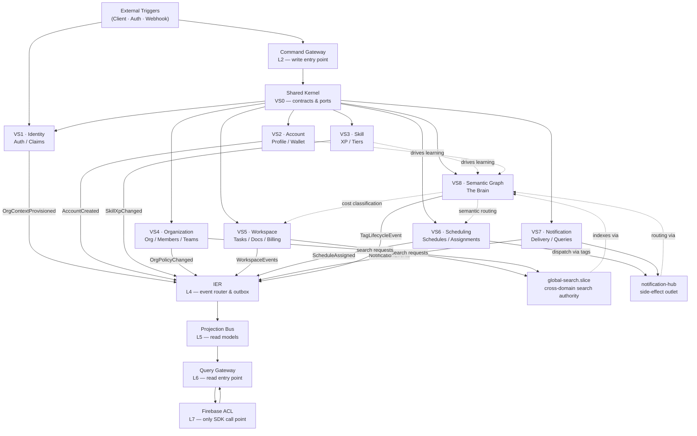

# Cross-Domain Graph Sketch

> Simplified relationship diagram for fast cross-domain navigation.
> This diagram shows **only domain names and relationships** — no implementation detail.
> For per-domain detail see `slices/*.md`.

## Relationship Legend

| Arrow | Meaning |
|-------|---------|
| `-->` | Hard dependency / event emission |
| `-.->` | Soft dependency / semantic influence |

## Key Constraints Visible in This Diagram

- **VS8 is the single semantic authority** — all routing and search ultimately go through it.
- **IER is the only fan-out point** — no slice talks directly to another slice's write path.
- **FBACL is the only Firebase SDK boundary** — all slices reach storage via ports, not directly.
- **global-search and notification-hub** are the only two cross-cutting authorities; all slices must delegate to them.
