# Command & Event Overview

> **Source of truth**: `docs/logic-overview.md`
> This document describes the complete command execution flow, event routing, and the IER lane system.

---

## Full Command Execution Sequence

```mermaid
sequenceDiagram
    participant A as _actions.ts
    participant RL as rate-limiter [S5]
    participant CB as circuit-breaker [S5]
    participant BH as bulkhead-router [S5]
    participant CBG as CBG_ENTRY (TraceID inject) [R8]
    participant AUTH as CBG_AUTH (AuthoritySnapshot) [#A9]
    participant ROUTE as CBG_ROUTE (command-router)
    participant TX as WS_TX_RUNNER (#A8)
    participant AGG as Domain Aggregate
    participant EB as EventBus (in-process)
    participant OB as OUTBOX [S1]
    participant RELAY as OUTBOX_RELAY [R1]
    participant IER as IER (integration-event-router)
    participant FUNNEL as event-funnel [#9, S2]

    A->>RL: Server Action invoked
    Note over RL: per user + per org rate check<br/>Excess → 429 + retry-after header
    RL->>CB: pass
    Note over CB: 5xx counter check<br/>Open circuit → reject immediately
    CB->>BH: pass
    Note over BH: slice isolation<br/>independent thread pool
    BH->>CBG: route to unified-command-gateway
    Note over CBG: inject traceId → EventEnvelope.traceId [R8]<br/>traceId is IMMUTABLE from this point
    CBG->>AUTH: authority check
    Note over AUTH: read workspaceScopeGuardView (fast path)<br/>High-risk → re-source from aggregate (#A9)
    AUTH->>ROUTE: authorized
    ROUTE->>TX: dispatch to slice handler
    Note over TX: 1 command / 1 aggregate (#A8)
    TX->>AGG: apply command
    AGG->>EB: raise DomainEvent (in-process)
    AGG->>OB: write pending event to OUTBOX [S1]
    Note over OB: idempotencyKey = eventId+aggId+version<br/>dlqTier declared per event type<br/>lane declared per event type
    OB-->>A: CommandResult (SK_CMD_RESULT) [R4]
    RELAY->>OB: Firestore onSnapshot CDC scan [R1]
    RELAY->>IER: deliver event to correct lane
    IER->>FUNNEL: route to event-funnel (#9)
    Note over FUNNEL: SK_VERSION_GUARD [S2]<br/>event.aggVersion > view.lastVersion → update<br/>else → discard
    FUNNEL->>FUNNEL: write to projection
```



---

## R4 Command Result Contract

Every command MUST return a `CommandResult` to the calling `_actions.ts` for client-side optimistic update decisions.

```typescript
type CommandResult = CommandSuccess | CommandFailure;

type CommandSuccess = {
  success: true;
  aggregateId: string;
  /** New aggregate version after applying the command */
  version: number;
};

type CommandFailure = {
  success: false;
  error: DomainError;
};

interface DomainError {
  code: string;
  message: string;
  aggregateId?: string;
}
```

### Client Usage Pattern

```typescript
// In _actions.ts
interface AddSkillXpInput {
  accountId: string;
  tagSlug: string;
  delta: number;
  reason: string;
  sourceId: string;
}

export async function addSkillXp(input: AddSkillXpInput): Promise<CommandResult> {
  // Goes through GW_GUARD → CBG_ENTRY → CBG_AUTH → CBG_ROUTE → TX_RUNNER → AGG
  const result = await commandGateway.dispatch({ type: 'AddSkillXp', ...input });
  return result; // CommandSuccess | CommandFailure
}

// In component
const result = await addSkillXp({ accountId: 'acc_123', tagSlug: 'react', delta: 10, reason: 'completed task', sourceId: 'task_456' });
if (result.success) {
  // Optimistic UI update: result.aggregateId, result.version
} else {
  // Show error: result.error.message
}
```

---

## IER Full Routing Table

### CRITICAL_LANE — 高優先最終一致

> Deliver ASAP. Processes authentication and financial state changes.

| Event | Source Outbox | Target Handler | Notes |
|-------|--------------|----------------|-------|
| `RoleChanged` | accOutbox | `CLAIMS_HANDLER` [S6][E6] + `TOKEN_REFRESH_SIGNAL` | DLQ: SECURITY_BLOCK; triggers 3-way handshake [SK_TOKEN_REFRESH_CONTRACT] |
| `PolicyChanged` | accOutbox | `CLAIMS_HANDLER` [S6][E6] + `TOKEN_REFRESH_SIGNAL` | DLQ: SECURITY_BLOCK |
| `WalletDeducted` | accOutbox | `FUNNEL` → CRITICAL_PROJ_LANE | DLQ: REVIEW_REQUIRED; updates `walletBalance` projection |
| `WalletCredited` | accOutbox | `FUNNEL` → CRITICAL_PROJ_LANE | DLQ: REVIEW_REQUIRED |
| `OrgContextProvisioned` | orgOutbox | `ORG_CONTEXT_ACL` [E2] | DLQ: REVIEW_REQUIRED; sets local Org Context in VS5 (#10) |

### STANDARD_LANE — SLA < 2s

| Event | Source Outbox | Target Handler | Notes |
|-------|--------------|----------------|-------|
| `SkillXpAdded` | skillOutbox | `FUNNEL` → CRITICAL_PROJ_LANE [P2] | DLQ: SAFE_AUTO; updates `orgEligibleMemberView` + `accountSkillView` |
| `SkillXpDeducted` | skillOutbox | `FUNNEL` → CRITICAL_PROJ_LANE [P2] | DLQ: SAFE_AUTO |
| `ScheduleAssigned` | schedOutbox | `NOTIF_ROUTER` + `FUNNEL` [E3] | DLQ: REVIEW_REQUIRED; triggers FCM push with traceId [R8] |
| `ScheduleProposed` | schedOutbox | `ORG_SCHEDULE` Saga [A5] | DLQ: SAFE_AUTO; saga evaluates and may compensate |
| `MemberJoined` | orgOutbox | `FUNNEL` [#16] | DLQ: SAFE_AUTO; updates `orgEligibleMemberView` eligible=true (#15) |
| `MemberLeft` | orgOutbox | `FUNNEL` [#16] | DLQ: SAFE_AUTO; updates eligible state |
| All Domain Events | all outboxes | `FUNNEL` [#9] | Rebuild support; all events flow through FUNNEL |

### BACKGROUND_LANE — SLA < 30s

| Event | Source Outbox | Target Handler | Notes |
|-------|--------------|----------------|-------|
| `TagLifecycleEvent` | tagOutbox | `FUNNEL` + `VS4_TAG_SUBSCRIBER` [T1][R3] | DLQ: SAFE_AUTO; updates `SKILL_TAG_POOL` + `tagSnapshot` |
| `AuditEvents` | wsOutbox | `AUDIT_COLLECTOR` [Q5] | DLQ: SAFE_AUTO; writes to `globalAuditView` with traceId [R8] |

---

## S5 Resilience Protection at Gateway Entry

All paths reaching `CBG_ENTRY` MUST pass through the `GW_GUARD` protection layer ([SK_RESILIENCE_CONTRACT S5]):

```
_actions.ts
    │
    ▼ [rate-limiter]
    • per user limit: reject → 429 + retry-after header
    • per org limit:  reject → 429 + retry-after header
    │
    ▼ [circuit-breaker]
    • consecutive 5xx threshold reached → circuit OPEN → reject immediately
    • half-open probe → allow 1 request → if success → circuit CLOSED
    │
    ▼ [bulkhead-router]
    • per-slice thread pool
    • fault in one slice does NOT propagate to other slices
    │
    ▼ CBG_ENTRY (TraceID injection)
```

---

## Event Naming Conventions

| Convention | Rule | Examples |
|-----------|------|---------|
| Past tense | Events describe things that HAPPENED | `RoleChanged`, `WalletDeducted`, `MemberJoined` |
| Domain prefix | Events are prefixed with their domain | `SkillXpAdded`, `OrgContextProvisioned`, `WorkflowBlocked` |
| EventEnvelope | All events MUST include `EventEnvelope` fields | `version`, `traceId`, `timestamp`, `idempotencyKey`, `eventId`, `aggregateId`, `aggregateVersion` |
| traceId immutability | `traceId` set at `CBG_ENTRY`, NEVER overwritten | IER, FUNNEL, FCM push all READ but never modify `traceId` [R8] |
| Compensating events | Saga failure events use `Rejected` or `Cancelled` suffix | `ScheduleAssignRejected`, `ScheduleProposalCancelled` |

---

## A軌 / B軌 Discrete Recovery Principle (VS5)

The Workspace Slice uses a dual-track business flow:

```mermaid
flowchart LR
    subgraph A_TRACK["🟢 A軌 — Main Flow"]
        TASKS["tasks"] --> QA["quality-assurance"] --> ACCEPT["acceptance"] --> FINANCE["finance"]
    end

    subgraph B_TRACK["🔴 B軌 — Exception Handling"]
        ISSUES{{"issues"}}
    end

    WORKFLOW["workflow.aggregate\nblockedBy Set"]
    WORKFLOW -->|"blockWorkflow(issueId)\nblockedBy.add(issueId)"| B_TRACK
    B_TRACK -->|"IssueResolved event\nblockedBy.delete(issueId)"| WORKFLOW
    WORKFLOW -.->|"blockedBy.isEmpty()\n→ unblockWorkflow"| A_TRACK

    style A_TRACK fill:#d1fae5
    style B_TRACK fill:#fee2e2
```



**Rules**:
1. **B軌 flows ONE-WAY** via `IssueResolved` event → `WORKFLOW_AGG` `blockedBy.delete(issueId)` (#A3)
2. **NEVER** B軌 directly back to A軌 — only via the `unblockWorkflow` gate on the aggregate
3. `unblockWorkflow` precondition: `blockedBy.isEmpty()` — all issues must be resolved
4. `ParsingIntent` (Digital Twin) may only propose events (`IntentDeltaProposed`) — NEVER directly mutate A軌 state (#A4)
