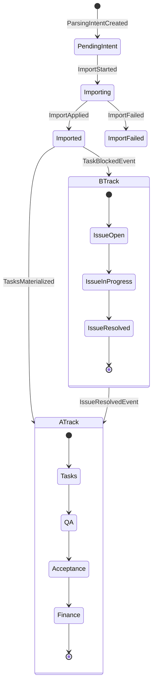

# workspace.slice-guide

> VS5（Workspace Slice）文件解析與任務落地設計指南。
>
> 目標：在不破壞既有 `files / tasks / issues` 子集合運作下，補齊 `ParsingIntent` 版本化、A/B Track 事件流、與 Firestore 子集合設計一致性。

---

## 1. 設計目標（VS5 視角）

1. **單一真相（SSOT）**：`ParsingIntent` 是「解析意圖與版本鏈」的真相；`tasks` 是「可執行工作項」的真相。
2. **雙軌治理**：
   - 🟢 A-track：`files -> parsingIntent -> tasks -> qa -> acceptance -> finance`
   - 🔴 B-track：`issues` 只透過事件介入，不直接回寫 A-track 狀態。
3. **可重放與冪等**：任何 Intent 匯入任務動作都可 replay，且不產生重複任務。
4. **契約一致**：集合命名、狀態列舉、版本語意與 outbox 事件一致。

---

## 2. 建議 Firestore 結構（Workspace scoped）

以 `workspaces/{workspaceId}` 為邊界，維持現有核心子集合並補齊解析域。

```text
workspaces/{workspaceId}
  files/{fileId}
  parsingIntents/{intentId}
  parsingImports/{importId}
  tasks/{taskId}
  issues/{issueId}
```

### 2.1 為什麼要新增 `parsingImports`

`parsingImports` 是 **intent -> tasks 物化帳本**，用於：

- 冪等鍵（`idempotencyKey`）去重
- 追蹤一次匯入產生了哪些 `taskIds`
- 重放時可判斷「已套用 / 部分套用 / 失敗」

> `parsingIntents` 負責「語義與版本」，`parsingImports` 負責「落地執行紀錄」。

---

## 3. Data Contracts（建議）

### 3.1 ParsingIntent

```ts
interface ParsingIntent {
  id: string
  workspaceId: string
  sourceFileId: string
  sourceVersionId: string
  intentVersion: number
  supersedesIntentId?: string
  status: 'pending' | 'importing' | 'imported' | 'superseded' | 'failed'
  extractedTasks: ParsingIntentTask[]
  createdAt: string
  updatedAt: string
  importedAt?: string
  failedAt?: string
  failureCode?: string
}
```

### 3.2 ParsingImport（新）

```ts
interface ParsingImport {
  id: string
  workspaceId: string
  intentId: string
  intentVersion: number
  idempotencyKey: string
  status: 'started' | 'applied' | 'partial' | 'failed'
  appliedTaskIds: string[]
  startedAt: string
  completedAt?: string
  error?: { code: string; message: string }
}
```

### 3.3 Task（與 Intent 關聯）

```ts
interface WorkspaceTask {
  id: string
  workspaceId: string
  title: string
  sourceIntentId: string
  sourceIntentVersion: number
  sourceFileId: string
  status: 'todo' | 'in_progress' | 'blocked' | 'done'
}
```

---

## 4. ParsingIntent 版本策略

1. 同一 `fileId + sourceVersionId` 首次解析建立 `intentVersion = 1`。
2. 檔案新版本重解析時建立新 intent：
   - `intentVersion = previous.intentVersion + 1`
   - `supersedesIntentId = previous.id`
3. 舊 intent 轉 `superseded`，不可再進入 import。
4. 只有 `pending` intent 可進入 import pipeline。

---

## 5. A/B Track 狀態機（Mermaid）



> B-track 回到 A-track 必須透過 `IssueResolvedEvent`，不能直接修改 A-track 文件（符合「事件回流」原則）。

---

## 6. 事件流與實作建議（穩健更新）

### 6.1 Import 主流程（A-track）

1. `saveParsingIntent`：寫入 `parsingIntents/{intentId}`（`pending`）。
2. 發送 `workspace:parsing-intent:deltaProposed`（outbox）。
3. Import handler 收到事件後：
   - 建立 `parsingImports/{importId}`（`started`）
   - 逐筆 upsert `tasks`（帶 `sourceIntentId/sourceIntentVersion`）
   - 成功後更新 `parsingImports.status=applied`
   - 將 intent 轉 `imported`

### 6.2 異常流程（B-track）

- 任務阻塞發 `workspace:tasks:blocked` -> 建立 `issues`。
- issue 解決發 `workspace:issues:resolved` -> 再由 handler 發 `workspace:tasks:unblocked`。
- A-track 只消費事件，不直接讀寫 `issues` 狀態機。

---

## 7. 子集合設計準則（現代化）

1. **命名一致**：全域統一 `parsingIntents`（或統一改為 `parsing_intents`，二選一，不可混用）。
2. **聚合責任分離**：
   - `parsingIntents`：語義 + 版本
   - `tasks`：執行狀態
   - `issues`：異常治理
   - `parsingImports`：匯入冪等與審計
3. **不可逆欄位保護**：`sourceIntentId/sourceIntentVersion/sourceFileId` 一旦寫入不得修改。
4. **冪等優先**：任何 handler 都先查 `idempotencyKey` 再執行。
5. **事件優先，不跨集合直寫狀態**：跨軌道只靠 domain events。

---

## 8. 推薦落地順序（最小風險）

1. 先補 `parsingImports` 與對應 repository（不改現有 `tasks/issues` API）。
2. 將 import handler 改為「先寫 import 帳本，再寫 tasks」。
3. 補齊 `intentVersion` 遞增與 `supersedesIntentId`。
4. 最後做集合命名收斂（若要由 `parsingIntents` 改 snake_case，需 migration script + dual-read 過渡期）。

---

## 9. 驗收清單（VS5）

- [ ] 同一 intent 重放不會重複新增 task。
- [ ] 新 intent 會正確 supersede 舊 intent。
- [ ] B-track issue 解決後僅透過事件解除 blocked。
- [ ] `tasks` 中 `sourceIntentId/sourceIntentVersion` 不可被更新 API 覆寫。
- [ ] 集合命名在 constants 與 repository 實作完全一致。

---

## 10. 結論

在 VS5 中，**ParsingIntent 不應與 tasks 競爭真相**：

- `ParsingIntent` 管「解析語義與版本生命週期」
- `tasks` 管「執行生命週期」
- `parsingImports` 管「匯入執行與冪等證據」

這樣可同時滿足：A-track 主流程穩定推進、B-track 異常可回收、以及 Firestore 子集合可演進與可審計。