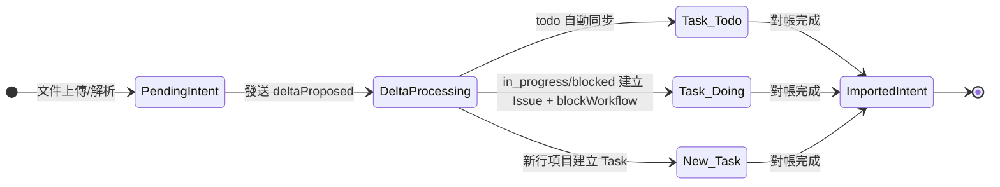

# workspace.slice-guide

> VS5（Workspace Slice）文件解析與任務落地設計指南。
>
> 目標：在不破壞既有 `files / tasks / issues` 子集合運作下，補齊 `ParsingIntent` 版本化、A/B Track 事件流、與 Firestore 子集合設計一致性。

---

## 1. 核心哲學：意圖即合約（Intent as Contract）

1. **單一真相（SSOT）**：`ParsingIntent` 是「解析意圖與版本鏈」的真相；`tasks` 是「可執行工作項」的真相。
2. **Digital Twin（數位孿生）**：`ParsingIntent` 建立後，其行項目與財務規格（數量、單價、小計）視為不可變語義快照；允許變更的僅限 lifecycle metadata（`status`, `importedAt`, `failedAt`, `supersededByIntentId`）。
3. **因果驅動**：`ParsingIntent` 是因、`WorkspaceTask` 是果；任務規格永遠可追溯到 `sourceIntentId`。
4. **雙軌治理**：
   - 🟢 A-track：`files -> parsingIntents -> tasks -> qa -> acceptance -> finance`
   - 🔴 B-track：`issues` 只透過事件介入，不直接回寫 A-track 狀態。

---

## 2. 建議 Firestore 結構（Workspace scoped）

以 `workspaces/{workspaceId}` 為邊界，維持現有核心子集合並補齊解析域。

```text
workspaces/{workspaceId}
  files/{fileId}
  parsingIntents/{intentId}
  parsingImports/{importId}
  tasks/{taskId}
  issues/{issueId}
```

### 2.1 為什麼要新增 `parsingImports`

`parsingImports` 是 **intent -> tasks 物化帳本**，用於：

- 記錄冪等鍵（`idempotencyKey` 欄位，建議格式：`import:{intentId}:{intentVersion}`，例如 `import:intent_abc123:2`）用於檢測重複匯入請求；命中重複 key 時直接返回既有 `ParsingImport` 結果，不重複落地 task
- 追蹤一次匯入產生了哪些 `taskIds`
- 重放時可判斷「已套用 / 部分套用 / 失敗」

> `parsingIntents` 負責「語義與版本」，`parsingImports` 負責「落地執行紀錄」。

---

## 3. Data Contracts（建議）

### 3.1 ParsingIntent

```ts
interface ParsingIntent {
  id: string
  workspaceId: string
  sourceFileId: string
  sourceVersionId: string
  intentVersion: number
  supersededByIntentId?: string // 寫在舊 intent，指向取代它的新 intent（例如 intent_v1.supersededByIntentId = intent_v2.id）
  status: 'pending' | 'importing' | 'imported' | 'superseded' | 'failed'
  extractedTasks: ParsingIntentTask[]
  createdAt: string
  updatedAt: string
  importedAt?: string
  failedAt?: string
  failureCode?: string
}
```

### 3.2 ParsingImport（新）

```ts
interface ParsingImport {
  id: string
  workspaceId: string
  intentId: string
  intentVersion: number
  idempotencyKey: string
  status: 'started' | 'applied' | 'partial' | 'failed'
  appliedTaskIds: string[]
  startedAt: string
  completedAt?: string
  error?: { code: string; message: string }
}
```

### 3.3 Task（與 Intent 關聯）

```ts
interface WorkspaceTask {
  id: string
  workspaceId: string
  title: string
  sourceIntentId: string
  sourceIntentVersion: number
  sourceFileId: string
  status: 'todo' | 'in_progress' | 'blocked' | 'done'
}
```

---

## 4. ParsingIntent 版本策略

1. 同一 `fileId + sourceVersionId` 首次解析建立 `intentVersion = 1`。
2. 檔案新版本重解析時建立新 intent：
   - `intentVersion = previous.intentVersion + 1`
   - 舊 intent 寫入 `supersededByIntentId = newIntent.id`
3. 舊 intent 轉 `superseded`，不可再進入 import。
4. 只有 `pending` intent 可進入 import pipeline。

---

## 5. IntentDelta 對帳算法（A/B Track）

當事件 `workspace:parsing-intent:deltaProposed` 進入 handler 時，依任務狀態採取以下行為：

| 任務狀態 (`progressState`) | 驅動行為 | 說明 |
|---|---|---|
| `todo` | 自動同步（Sync） | 就地同步任務財務欄位（`quantity / unitPrice / subtotal`）；不修改 `sourceIntentId / sourceIntentVersion / sourceFileId` |
| `task.status` ∈ {`in_progress`, `blocked`} | 衝突偵測（Conflict） | 不改任務內容，建立 `WorkspaceIssue` 並阻塞 workflow |
| `task.status = done`（或 `workflow.currentStage` ∈ {`Acceptance`,`Finance`,`Completed`}） | 忽略（Ignore） | 已完工或已驗收任務不因新 Intent 改動 |
| 新增行項目 | 增量建立（Create） | 建立新 Task，`sourceIntentId` 指向新 Intent |

---

## 6. 狀態機圖解（Mermaid）



> B-track 回到 A-track 必須透過 `IssueResolvedEvent`，不能直接修改 A-track 文件（符合「事件回流」原則）。

---

## 7. 事件流與實作建議（穩健更新）

### 7.1 Import 主流程（A-track）

1. `saveParsingIntent`：寫入 `parsingIntents/{intentId}`（`pending`）。
2. 發送 `workspace:parsing-intent:deltaProposed`（outbox）。
3. Import handler 收到事件後：
   - `ParsingIntent` 僅產生 proposal 類事件（如 `workspace:parsing-intent:deltaProposed`），不得直接寫入 A-track 聚合根；此約束用於維持 aggregate 邊界與 command handler 單一寫入入口（對齊 `logic-overview.md` 的 #A4：ParsingIntent 只允許提議事件）。
   - 建立 `parsingImports/{importId}`（`started`）
   - 逐筆 upsert `tasks`（帶 `sourceIntentId/sourceIntentVersion`）
   - 成功後更新 `parsingImports.status=applied`
   - 將 intent 轉 `imported`

### 7.2 異常流程（B-track）

- workflow 阻塞發 `workspace:workflow:blocked` -> 建立 `issues`。
- issue 解決發 `workspace:issues:resolved` -> 由 workflow handler 在同一 transaction 內執行 `blockedBy.delete(issueId)`；若 `blockedBy`（`Set<issueId>`）清空再發 `workspace:workflow:unblocked`。

```ts
// workflow side (transaction scope)
if (blockedBy.has(issueId)) {
  blockedBy.delete(issueId)
} else {
  metrics.increment('workflow.unknownIssueId')
  // idempotent replay / race condition: ignore unknown issueId
}
if (blockedBy.size === 0) {
  emit('workspace:workflow:unblocked')
}
```
- workflow 阻塞語義採 #A3：每個 issueId 需加入 `workflow.blockedBy`；僅當 `blockedBy` 清空（allIssuesResolved）才可解除阻塞。
- A-track 只消費事件，不直接讀寫 `issues` 狀態機。
- 實作約束：B-track handler 禁止直接調用 `tasks` repository 寫入 API；B-track 僅發布 issue 事件，不決定 workflow 是否解除，解除判定必須經 `workflow.aggregate.unblockWorkflow(issueId): CommandResult`（#A3）。

---

## 8. 子集合設計準則（現代化）

1. **命名一致**：全域統一使用 `parsingIntents`（camelCase），並與 `files`、`tasks`、`issues` 一致。
2. **聚合責任分離**：
   - `parsingIntents`：語義 + 版本
   - `tasks`：執行狀態
   - `issues`：異常治理
   - `parsingImports`：匯入冪等與審計
3. **不可逆欄位保護**：`sourceIntentId/sourceIntentVersion/sourceFileId` 一旦寫入不得修改（需在 repository 層與 Firestore rules 同步實施 write-once，核心原則是「更新時 immutable 欄位新舊值必須完全一致」）。
4. **冪等優先**：任何 handler 都先查 `idempotencyKey` 再執行。
5. **事件優先，不跨集合直寫狀態**：跨軌道只靠 domain events。

---

## 9. 推薦落地順序（最小風險）

1. 先補 `parsingImports` 與對應 repository（不改現有 `tasks/issues` API）。
2. 將 import handler 改為「先寫 import 帳本，再寫 tasks」。
3. 補齊 `intentVersion` 遞增與 `supersededByIntentId`。
4. 最後做集合命名收斂（constants、repository、query 皆使用同一個 `parsingIntents` 路徑字串）。

---

## 10. 開發者檢查清單（Developer Checklist）

1. **寫入限制**：`business.tasks` 更新 action 不允許手動修改 Intent 帶入欄位（`sourceIntentId/sourceIntentVersion/sourceFileId`）；IntentDelta 同步僅可更新財務欄位，不可覆寫 source pointers。若違反應回傳 validation error 並拒絕 transaction。
2. **原子性操作**：IntentDelta 對帳以 transaction 或 writeBatch 執行，確保 Intent 狀態與 Task 更新同批提交。
3. **事件訂閱**：`tasks` handler 訂閱 `workspace:parsing-intent:deltaProposed`，且 payload 必含 `oldIntentId`。
4. **狀態遷移**：對帳完成後，必須將新 Intent 狀態由 `pending` 推進至 `imported`。

---

## 11. 驗收清單（VS5）

> 測試策略建議：沿用目前已存在的 `src/features/workspace.slice/business.document-parser/` 與 `src/features/workspace.slice/business.tasks/` `*.test.ts` 結構新增對應規格（idempotency、supersede、event-only recovery、immutable source pointers、collection naming consistency）。每項驗收條件對應至少一個測試案例。

| 驗收項目 | 測試型別 | 關鍵情境 |
|---|---|---|
| 同一 intent 重放不重複新增 task | integration | 連續兩次提交相同 `idempotencyKey`，第二次返回既有 import 結果 |
| 新 intent 正確 supersede 舊 intent | unit + integration | 建立 v2 intent 後，v1 轉 `superseded` 且不可再次 import |
| B-track 只透過事件解除 blocked | integration | issue resolved 僅產生 event，由 task handler 更新 task |
| source pointers 不可覆寫 | unit | update task 時嘗試改 `sourceIntentId/sourceIntentVersion/sourceFileId` 應被拒絕 |
| 集合命名一致 | unit | constants、repository、query path 比對一致 |

- [ ] 同一 intent 重放不會重複新增 task。
- [ ] 新 intent 會正確 supersede 舊 intent。
- [ ] B-track issue 解決後僅透過事件解除 blocked。
- [ ] `tasks` 中 `sourceIntentId/sourceIntentVersion` 不可被更新 API 覆寫。
- [ ] 集合命名在 constants 與 repository 實作完全一致。

---

## 12. 結論

在 VS5 中，**ParsingIntent 不應與 tasks 競爭真相**：

- `ParsingIntent` 管「解析語義與版本生命週期」
- `tasks` 管「執行生命週期」
- `parsingImports` 管「匯入執行與冪等證據」

這樣可同時滿足：A-track 主流程穩定推進、B-track 異常可回收、以及 Firestore 子集合可演進與可審計。

在長期擴展上，Intent 驅動模型具備更好的 AI 協作優勢：語義快照穩定、版本差異可機器對比、衝突決策可由人機協同處理，且事件鏈可直接支援後續自動化治理與審計。