# Infrastructure Overview

> **Source of truth**: `docs/logic-overview.md`
> This document describes the async infrastructure components: Outbox Relay Worker, DLQ system, IER routing, and Claims management.

---

## R1 Outbox Relay Worker

The Outbox Relay Worker is a **shared infra component** used by all 6 outbox tables. It runs as a Firebase Function (`functions/outbox-relay`).

### Spec

| Property | Value |
|----------|-------|
| Scan strategy | Firestore real-time listener via `onSnapshot` (Change Data Capture pattern) |
| Delivery target | OUTBOX → IER corresponding Lane |
| Retry strategy | Exponential backoff |
| Failure threshold | 3 failures → DLQ (with tier tag from SK_OUTBOX_CONTRACT) |
| Metrics | `relay_lag` → VS9 `domain-metrics` |

### Flow

```mermaid
flowchart LR
    subgraph OUTBOXES["6 Outbox Collections"]
        TO["tagOutbox\n[SAFE_AUTO]"]
        AO["accOutbox\n[REVIEW_REQUIRED / SECURITY_BLOCK]"]
        OO["orgOutbox\n[REVIEW_REQUIRED / SAFE_AUTO]"]
        SO["skillOutbox\n[SAFE_AUTO]"]
        WO["wsOutbox\n[SAFE_AUTO]"]
        SCO["schedOutbox\n[REVIEW_REQUIRED / SAFE_AUTO]"]
    end

    RELAY["outbox-relay-worker\nFirestore onSnapshot CDC\nExponential backoff retry\n3 failures → DLQ"]

    subgraph IER_LANES["IER Priority Lanes"]
        CL["🔴 CRITICAL_LANE"]
        SL["🟡 STANDARD_LANE"]
        BL["⚪ BACKGROUND_LANE"]
    end

    subgraph DLQ_SYSTEM["DLQ Three-Tier System"]
        DLQ["dead-letter-queue"]
        SA["🟢 SAFE_AUTO\nAuto-replay"]
        RR["🟡 REVIEW_REQUIRED\nHuman review"]
        SB["🔴 SECURITY_BLOCK\nAlert + Freeze"]
        DLQ --> SA & RR & SB
    end

    OUTBOXES --> RELAY
    RELAY --> CL & SL & BL
    RELAY -->|"3 failures"| DLQ
    SA -.->|"Auto Replay (idempotency-key)"| IER_LANES
    RR -.->|"Manual confirm → Replay"| IER_LANES
    SB -.->|"Alert"| DOMAIN_ERRORS["domain-error-log"]

    RELAY -.->|"relay_lag"| METRICS["domain-metrics (VS9)"]
```

---

## All 6 Outbox Tables

| Collection | Producer Slice | DLQ Tier Declarations | Lane |
|-----------|---------------|----------------------|------|
| `tagOutbox` | VS0 centralized-tag | `TagLifecycleEvent` → SAFE_AUTO | BACKGROUND_LANE |
| `accOutbox` | VS2 account | `RoleChanged/PolicyChanged` → SECURITY_BLOCK; `WalletDeducted` → REVIEW_REQUIRED; `AccountCreated` → SAFE_AUTO | CRITICAL (Role/Policy/Wallet) · STANDARD (AccountCreated) |
| `orgOutbox` | VS4 organization | `OrgContextProvisioned` → REVIEW_REQUIRED; `MemberJoined/Left` → SAFE_AUTO; `SkillRecognitionGranted/Revoked` → REVIEW_REQUIRED | CRITICAL (OrgContextProvisioned) · STANDARD (others) |
| `skillOutbox` | VS3 skill | `SkillXpAdded/Deducted` → SAFE_AUTO | STANDARD_LANE |
| `wsOutbox` | VS5 workspace | Business events (idempotent) → SAFE_AUTO; Unique IER delivery source [E5] | STANDARD_LANE |
| `schedOutbox` | VS6 scheduling | `ScheduleAssigned` → REVIEW_REQUIRED; Compensating events → SAFE_AUTO | STANDARD_LANE |

All outbox records carry:
1. **`idempotencyKey`** = `eventId + aggregateId + aggregateVersion` (format per SK_OUTBOX_CONTRACT [S1])
2. **`dlqTier`** declared at outbox definition (not at relay time)
3. **`lane`** target for IER routing

---

## DLQ Three-Tier System

| Tier | Trigger | Processing | Examples |
|------|---------|-----------|---------|
| `SAFE_AUTO` | Idempotent events; 3 relay failures | Auto-replay preserving `idempotencyKey` | TagLifecycleEvent, AccountCreated, MemberJoined |
| `REVIEW_REQUIRED` | Financial / scheduling / role events; 3 relay failures | Human review via DLQ Manager UI; manual replay after confirmation | WalletDeducted, ScheduleAssigned, OrgContextProvisioned |
| `SECURITY_BLOCK` | Security-sensitive events; 3 relay failures | Alert → `DOMAIN_ERRORS`; account freeze; requires explicit human authorization | RoleChanged, PolicyChanged, ClaimsRefresh failure |

### DLQ Processing Flows

```mermaid
flowchart TD
    F["3 Relay Failures"]
    F -->|"read dlqTier"| TIER_CHECK{DLQ Tier?}
    TIER_CHECK -->|"SAFE_AUTO"| AUTO["Auto-replay\n(retain idempotencyKey)"]
    TIER_CHECK -->|"REVIEW_REQUIRED"| REVIEW["Queue for human review\n→ DLQ Manager UI\n→ Manual replay"]
    TIER_CHECK -->|"SECURITY_BLOCK"| BLOCK["Alert domain-error-log\nFreeze affected entity\nRequire explicit authorization"]
    AUTO -->|"Replay"| IER["IER (original lane)"]
    REVIEW -->|"Human confirms"| IER
    BLOCK -->|"Security team resolves"| IER
```

---

## IER Full Routing Table

The Integration Event Router (IER) is the single integration event exit point for the system (#9). It enforces `traceId` preservation [R8] — the `envelope.traceId` is NEVER overwritten in transit.

### CRITICAL_LANE — 高優先最終一致

| Event | Target | Reference |
|-------|--------|-----------|
| `RoleChanged` | `CLAIMS_HANDLER` [S6][E6] + `TOKEN_REFRESH_SIGNAL` | SK_TOKEN_REFRESH_CONTRACT |
| `PolicyChanged` | `CLAIMS_HANDLER` [S6][E6] + `TOKEN_REFRESH_SIGNAL` | SK_TOKEN_REFRESH_CONTRACT |
| `WalletDeducted` | `FUNNEL` → CRITICAL_PROJ_LANE | SK_READ_CONSISTENCY [S3] |
| `WalletCredited` | `FUNNEL` → CRITICAL_PROJ_LANE | SK_READ_CONSISTENCY [S3] |
| `OrgContextProvisioned` | `ORG_CONTEXT_ACL` [E2] | #10 |

### STANDARD_LANE — SLA < 2s

| Event | Target | Reference |
|-------|--------|-----------|
| `SkillXpAdded` | `FUNNEL` → CRITICAL_PROJ_LANE [P2] | #11, #12 |
| `SkillXpDeducted` | `FUNNEL` → CRITICAL_PROJ_LANE [P2] | #11, #12 |
| `ScheduleAssigned` | `NOTIF_ROUTER` + `FUNNEL` [E3] | #14, #15 |
| `ScheduleProposed` | `ORG_SCHEDULE` Saga [A5] | #A5 |
| `MemberJoined` | `FUNNEL` [#16] | #15, #16 |
| `MemberLeft` | `FUNNEL` [#16] | #15, #16 |
| All Domain Events | `FUNNEL` [#9] | #9 |

### BACKGROUND_LANE — SLA < 30s

| Event | Target | Reference |
|-------|--------|-----------|
| `TagLifecycleEvent` | `FUNNEL` + `VS4_TAG_SUBSCRIBER` [T1][R3] | T1, T2 |
| `AuditEvents` | `AUDIT_COLLECTOR` [Q5] | Q5, R8 |

---

## S6 Claims Management — TOKEN_REFRESH_SIGNAL Handshake

The three-party handshake is fully specified in `SK_TOKEN_REFRESH_CONTRACT [S6]`.

### Handshake Rules

1. **Trigger**: `RoleChanged` or `PolicyChanged` event enters IER `CRITICAL_LANE`
2. **Handler**: IER routes to `CLAIMS_HANDLER` in VS1
3. **Completion signal**: After Claims are set, VS1 emits `TOKEN_REFRESH_SIGNAL`
4. **Client obligation**: On receiving `TOKEN_REFRESH_SIGNAL`, client MUST force re-fetch Firebase token and carry new Claims on next request
5. **Failure path**: `ClaimsRefresh` failure → DLQ `SECURITY_BLOCK` → `DOMAIN_ERRORS` security alert

---

## Firebase Functions Deployment

| Function | Purpose | Trigger | Notes |
|----------|---------|---------|-------|
| `outbox-relay` | Scans outbox collections; delivers to IER | Firestore `onSnapshot` CDC | Shared across all 6 outbox tables [R1] |
| `dlq-manager` | Processes DLQ items by tier | Firestore `onWrite` on DLQ collection | Handles SAFE_AUTO auto-replay; exposes admin interface for REVIEW_REQUIRED [R5] |

Firebase Functions are located in the `functions/` workspace directory. Node.js 20 LTS is required (matching runtime constraint).

### Async Constraints

- Max execution time: 540 seconds (9 minutes) for Firestore-triggered functions
- DLQ retry budget: 3 attempts with exponential backoff before moving to DLQ
- `relay_lag` metric must be emitted to VS9 `domain-metrics` for each delivery attempt
- All function handlers must propagate `traceId` from the originating event envelope [R8]
