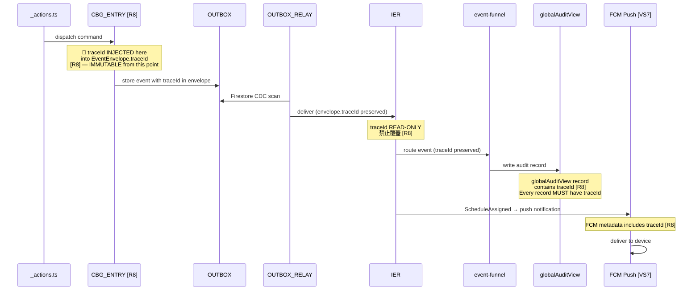
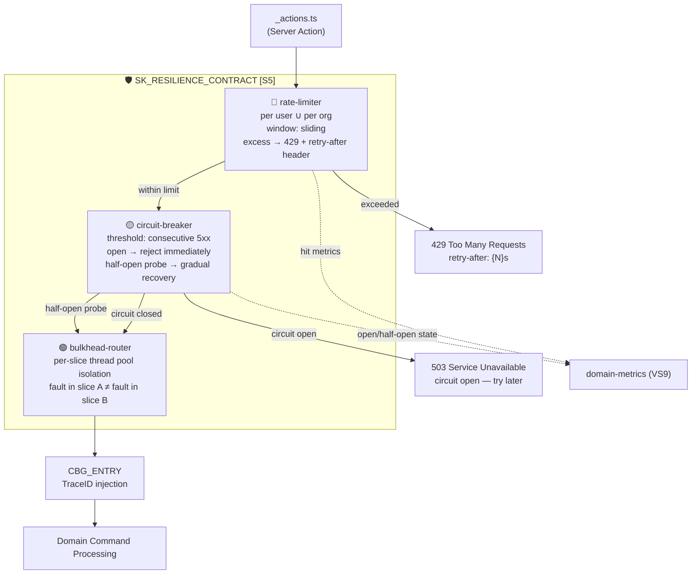

# Request Execution Overview

> **Source of truth**: `docs/logic-overview.md`
> This document describes the full request lifecycle: command path, read path, TraceID penetration, and resilience layer.

---

## R8 TraceID Penetration — Full Sequence

The `traceId` is injected ONCE at `CBG_ENTRY` and propagated immutably across the entire event chain.



### TraceID Rules

| Rule | Description |
|------|-------------|
| Injection point | `CBG_ENTRY` (unified-command-gateway) — the ONLY place `traceId` is set |
| Immutability | After injection, `traceId` MUST NOT be overwritten by any downstream node |
| Propagation | All nodes: IER, FUNNEL, Projections, FCM — pass `traceId` through unchanged |
| Audit requirement | Every `globalAuditView` record MUST contain `traceId` |
| Metrics | FUNNEL emits `traceId` to `domain-metrics` (VS9) per event |
| FCM | Push notification metadata MUST include `traceId` |

---

## S5 Resilience Protection Layer



### Rate Limiter

- Tracks requests per `accountId` AND per `orgId`
- Uses sliding window
- Response: `HTTP 429` + `retry-after` header with seconds until window resets
- Metrics: hit count → VS9 `domain-metrics`

### Circuit Breaker

- Opens after N consecutive 5xx responses (configurable per `SK_RESILIENCE_CONTRACT [S5]`)
- Open state: immediately reject all requests with `503`
- Half-open state: allow 1 probe request; if successful → close; if fails → re-open
- State transitions → VS9 `domain-metrics`

### Bulkhead Router

- Each slice has its own thread pool / concurrency quota
- A misbehaving or overloaded slice CANNOT exhaust resources of adjacent slices
- Slice identifier: `sliceId` from `BulkheadConfig`

---

## Command Path (Write)

```
_actions.ts
    │
    ├─[S5]─► GW_GUARD (rate-limiter → circuit-breaker → bulkhead-router)
    │
    ├─[R8]─► CBG_ENTRY — injects traceId into EventEnvelope
    │
    ├─[#A9]─► CBG_AUTH — reads workspaceScopeGuardView (fast path)
    │          └── high-risk → re-source from aggregate (STRONG_READ)
    │
    ├───────► CBG_ROUTE — dispatches to slice command handler
    │
    ├─[#A8]─► WS_TX_RUNNER — 1 command / 1 aggregate atomic commit
    │
    ├───────► Domain Aggregate — applies command, raises DomainEvent
    │
    ├─[S1]──► OUTBOX — writes pending event (idempotencyKey + dlqTier + lane)
    │
    ├─[R4]──► Returns CommandResult to _actions.ts (SK_CMD_RESULT)
    │
    ├─[R1]──► OUTBOX_RELAY (Firestore CDC) — scans and delivers
    │
    └─[P1]──► IER — routes to CRITICAL / STANDARD / BACKGROUND lane
```

**SLA Targets**:

| Phase | Target |
|-------|--------|
| _actions.ts → CommandResult | < 200ms (P99) |
| OUTBOX_RELAY pickup | < 500ms |
| CRITICAL_LANE projection update | ≤ 500ms |
| STANDARD_LANE projection update | ≤ 10s |

---

## Read Path (Query)

```
_actions.ts (or _queries.ts)
    │
    ├─[S3]──► Decision: STRONG_READ or EVENTUAL_READ?
    │          │
    │          ├── Financial / Auth / Irreversible
    │          │       └──[S3 STRONG_READ]──► Domain Aggregate (Firestore direct)
    │          │
    │          └── Display / Statistics / Lists
    │                  └──[S3 EVENTUAL_READ]──► Query Gateway
    │
    └──────────► QUERY_GATEWAY [S2][S3]
                    │
                    ├─[S2]─ All queries use read-model-registry
                    │        enforces SK_VERSION_GUARD
                    │
                    ├───► workspaceScopeGuardView (CRITICAL, ≤500ms)
                    ├───► orgEligibleMemberView (CRITICAL, ≤500ms)
                    ├───► walletBalance (CRITICAL, display-only)
                    ├───► workspaceView (STANDARD, ≤10s)
                    ├───► accountView (STANDARD, ≤10s)
                    ├───► accountSkillView (STANDARD, ≤10s)
                    ├───► organizationView (STANDARD, ≤10s)
                    ├───► globalAuditView (STANDARD, ≤10s)
                    └───► tagSnapshot (BACKGROUND, ≤30s)
```

**Read Path Decision Tree [S3]**:

```mermaid
flowchart TD
    Q["Read Request"]
    Q --> D{Decision [S3]}
    D -->|"Financial transaction?"| STRONG_FIN["STRONG_READ\n→ account-wallets aggregate"]
    D -->|"Authorization check (high-risk #A9)?"| STRONG_AUTH["STRONG_READ\n→ workspace-core aggregate"]
    D -->|"Irreversible operation?"| STRONG_IRREV["STRONG_READ\n→ domain aggregate"]
    D -->|"Display / stats / list"| EVENTUAL["EVENTUAL_READ\n→ Projection via Query Gateway"]
    STRONG_FIN & STRONG_AUTH & STRONG_IRREV & EVENTUAL --> RESP["Response"]
```

---

## SLA Summary Table

| Path Type | Target | Source |
|-----------|--------|--------|
| Command → CommandResult (R4) | < 200ms (P99) | TX_RUNNER synchronous |
| CRITICAL_LANE projection freshness | ≤ 500ms | IER → FUNNEL → CRITICAL_PROJ_LANE |
| STANDARD_LANE projection freshness | ≤ 10s | IER → FUNNEL → STANDARD_PROJ_LANE |
| BACKGROUND_LANE (tag, audit) | ≤ 30s | IER → FUNNEL → BACKGROUND_LANE |
| OUTBOX_RELAY pickup lag | Monitored via `relay_lag` | OUTBOX_RELAY → VS9 metrics |
| STRONG_READ query | Direct Firestore read | Domain Aggregate collection |
| EVENTUAL_READ query | Projection freshness bound | Per lane SLA above |

---

## Observability Integration (VS9)

All request execution nodes report to VS9:

| Node | Metric / Signal |
|------|----------------|
| `CBG_ENTRY` | Injects `traceId`; emits to `trace-identifier` |
| `rate-limiter` | Hit count → `domain-metrics` |
| `circuit-breaker` | Open/half-open state → `domain-metrics` |
| `IER` | Lane throughput + latency → `domain-metrics` |
| `FUNNEL` | Per-lane processing time → `domain-metrics` |
| `OUTBOX_RELAY` | `relay_lag` → `domain-metrics` [R1] |
| `WS_TX_RUNNER` | Errors → `domain-error-log` |
| `SCHEDULE_SAGA` | Compensating event failures → `domain-error-log` |
| `DLQ_BLOCK` | Security events → `domain-error-log` |
| `TAG_STALE_GUARD` | `StaleTagWarning` → `domain-error-log` |
| `TOKEN_REFRESH_SIGNAL` | Refresh failures → `domain-error-log` [S6] |
